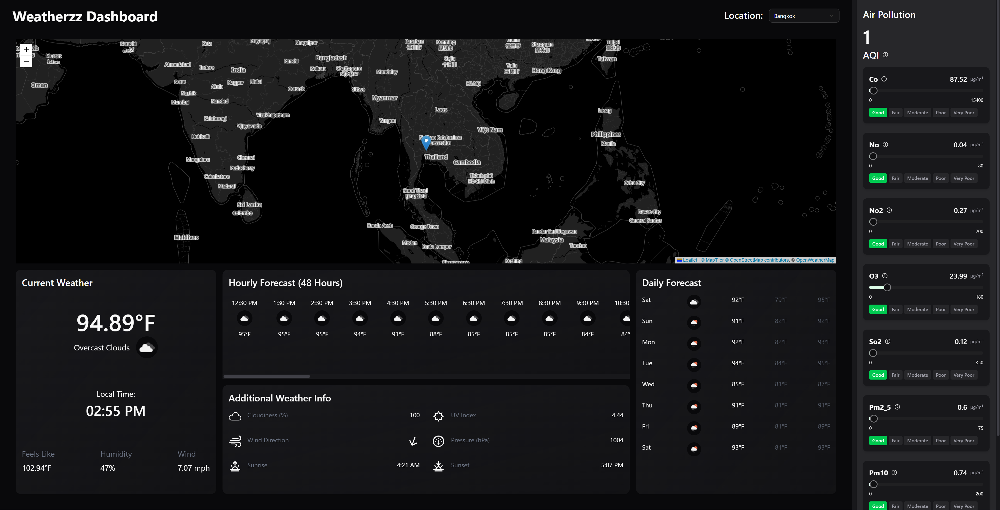

# Weatherzz Dashboard

A modern and responsive weather dashboard built with **React**, **TypeScript**, **Vite**, **Tailwind CSS**, and **Leaflet**.
The application provides real-time weather information, hourly and daily forecasts, interactive weather maps, and detailed air pollution analytics.

---

## Preview

### Dashboard UI

![Image]

---

# Features

## Real-Time Weather Data

* Current temperature
* Feels-like temperature
* Humidity
* Wind speed
* Pressure
* UV Index
* Cloudiness
* Wind direction
* Local time support

---

## Forecast System

### Hourly Forecast

* 48-hour weather prediction
* Temperature updates
* Weather icons
* Scrollable timeline UI

### Daily Forecast

* Multi-day forecast
* Min/Max temperatures
* Weather conditions

---

## Interactive Weather Maps

Supports multiple weather overlays:

* Precipitation
* Temperature
* Wind
* Clouds
* Pressure

Built using:

* Leaflet
* React Leaflet
* MapTiler SDK
* OpenWeatherMap layers

---

## Air Pollution Monitoring

Detailed AQI system with pollutant-level tracking:

* CO
* NO
* NO2
* O3
* SO2
* PM2.5
* PM10
* NH3

Each pollutant includes:

* Live concentration value
* Quality indicator
* Visual pollution scale

---

## Responsive UI

Optimized for:

* Desktop
* Tablet
* Mobile devices

Includes:

* Mobile header
* Adaptive layouts
* Scrollable forecast cards
* Responsive side panels

---

## Loading Skeletons

Custom loading states for:

* Current weather
* Forecast cards
* Air pollution section
* Additional weather info

Improves perceived performance and user experience.

---

# Tech Stack

## Frontend

* React
* TypeScript
* Vite

## Styling

* Tailwind CSS
* Shadcn UI
* clsx
* tailwind-merge

## Maps & Visualization

* Leaflet
* React Leaflet
* MapTiler SDK

## APIs

* OpenWeatherMap API
* MapTiler API

---

# Folder Structure

```bash
src
│
├── assets
│
├── components
│   ├── cards
│   │   ├── AdditionalWeatherInfo.tsx
│   │   ├── Card.tsx
│   │   ├── CurrentWeather.tsx
│   │   ├── DailyForecast.tsx
│   │   └── HourlyForecast.tsx
│   │
│   ├── dropdowns
│   │   ├── LocationDropdown.tsx
│   │   └── MapTypeDropdown.tsx
│   │
│   ├── skeletons
│   │   ├── AdditionalInfoSkeleton.tsx
│   │   ├── AirPollutionSkeleton.tsx
│   │   ├── CurrentWeatherSkeleton.tsx
│   │   ├── DailyForecastSkeleton.tsx
│   │   └── HourlyForecastSkeleton.tsx
│   │
│   └── ui
│       ├── Icon.tsx
│       ├── LoadingState.tsx
│       ├── Map.tsx
│       ├── MapLegend.tsx
│       ├── MobileHeader.tsx
│       ├── SidePanel.tsx
│       ├── ThemeProvider.tsx
│       └── WeatherIcon.tsx
│
├── lib
│   └── utils.ts
│
├── utils
│   ├── airPollution.ts
│   ├── ForecastTypeEnum.ts
│   ├── MapTypeEnum.ts
│   └── timeOptions.ts
│
├── api.ts
├── App.tsx
├── Dashboard.tsx
├── index.css
├── main.tsx
├── types.ts
└── vite-env.d.ts
```

---

# Installation

## 1. Clone Repository

```bash
git clone https://github.com/your-username/weatherzz-dashboard.git
```

---

## 2. Navigate Into Project

```bash
cd weatherzz-dashboard
```

---

## 3. Install Dependencies

```bash
npm install
```

---

# Environment Variables

Create a `.env` file in the root directory.

```env
VITE_OPENWEATHER_API_KEY=your_openweather_api_key
VITE_MAPTILER_API_KEY=your_maptiler_api_key
```

---

# Running the Project

## Development Server

```bash
npm run dev
```

---

## Production Build

```bash
npm run build
```

---

## Preview Production Build

```bash
npm run preview
```

---

# API Setup

## OpenWeatherMap

Used for:

* Current weather
* Forecasts
* AQI data
* Weather overlays

Get API Key:

[OpenWeatherMap](https://openweathermap.org/api?utm_source=chatgpt.com)

---

## MapTiler

Used for:

* Dark map styling
* Interactive map rendering

Get API Key:

[MapTiler](https://www.maptiler.com?utm_source=chatgpt.com)

---

# Core Functionalities

## Theme System

The application supports:

* Dark mode
* Light mode
* Persistent theme storage using localStorage

Handled inside:

```bash
components/ui/ThemeProvider.tsx
```

---

## Dynamic Weather Maps

Map layers update dynamically depending on selected map type.

Supported overlays:

```ts
export const MapTypeEnum = {
  Precipitation: "precipitation_new",
  Temperature: "temp_new",
  Cloud: "clouds_new",
  Wind: "wind_new",
  Pressure: "pressure_new",
} as const;
```

---

## Reusable Card Architecture

UI is componentized into reusable cards:

* Forecast cards
* Weather cards
* Pollution cards
* Information cards

Provides:

* Cleaner codebase
* Easier scaling
* Better maintainability

---

## Skeleton Loading System

Each major section has independent skeleton loaders to avoid layout shifting during API fetches.

---

# Performance Optimizations

* Lazy rendering patterns
* Reusable components
* Minimal prop drilling
* Centralized utility functions
* Tailwind utility optimization
* Type-safe API structures with TypeScript

---

# Future Improvements

Potential upgrades:

* Search-based locations
* Geolocation support
* Weather alerts
* Radar animation
* Favorite cities
* PWA support
* Offline caching
* Charts for temperature trends
* Unit conversion (°C / °F)
* Multi-language support

---

# Deployment

## Deploy on Vercel

Install Vercel CLI:

```bash
npm install -g vercel
```

Deploy:

```bash
vercel
```

---

# Dependencies

Example major dependencies used in the project:

```json
{
  "react": "^18",
  "typescript": "^5",
  "vite": "^5",
  "tailwindcss": "^3",
  "leaflet": "^1",
  "react-leaflet": "^4"
}
```

---

# Screens Included

The dashboard contains:

* Interactive weather map
* Current weather card
* Hourly forecast section
* Daily forecast panel
* AQI side panel
* Additional weather metrics

---

# Design Goals

This project focuses on:

* Modern UI/UX
* Smooth user experience
* Fast rendering
* Clean architecture
* Scalability
* Component reusability
* Responsive layouts

---

# Learning Outcomes

This project demonstrates:

* Advanced React component architecture
* API integration
* TypeScript usage
* State management patterns
* Map integration
* Responsive UI design
* Skeleton loading patterns
* Real-world dashboard development

---

# License

This project is licensed under the MIT License.

---

# Author

Built by Divyanshu.
